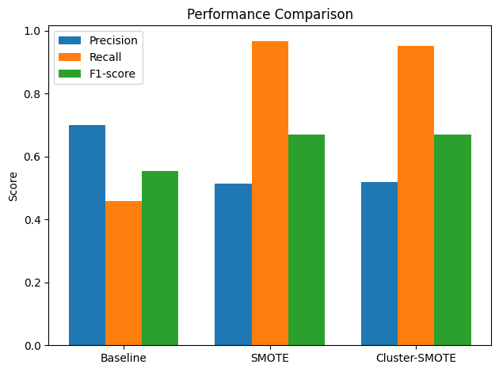

# SMOTE Implementation

SMOTE (Synthetic Minority Over-sampling Technique) helps when the datset is imbalanced.
When a dataset has more samples of one class and very few of another, the model tends to predict the majority class more oftens. SMOTE helps to fix this issue by creating new synthetic samples for the smaller (minority) class.

## Mathematical Formulation

### Class Imbalance Setting

Given a dataset

$$
\mathcal{D} = \{(x_i, y_i)\}_{i=1}^{N}, \quad y_i \in \{0,1\}
$$

where the minority class satisfies

$$
N_{\text{min}} \ll N_{\text{maj}}
$$

standard classifiers tend to bias the decision boundary toward the majority class.

---

## SMOTE (Synthetic Minority Over-sampling Technique)

SMOTE generates synthetic minority samples using linear interpolation.

### Step 1: Minority Set

$$
X_{\text{min}} = \{x_i \mid y_i = y_{\text{minority}}\}
$$

### Step 2: k-Nearest Neighbors

For each $(x_i \in X_{\text{min}}$), find:

$$
\mathcal{N}_k(x_i) \subset X_{\text{min}}
$$

### Step 3: Synthetic Sample Generation

$$
x_{\text{new}} = x_i + \lambda (x_{nn} - x_i), \quad \lambda \sim U(0,1)
$$

where $(x_{nn} \in \mathcal{N}_k(x_i)$).

This produces samples along the line segment between two minority points.

### Resulting Dataset

$$
X' = X \cup X_{\text{syn}}, \quad y' = y \cup y_{\text{syn}}
$$

---

## Limitation of Standard SMOTE

SMOTE assumes a single continuous minority region. If minority samples form multiple disjoint clusters,

$$
\|x_i - x_j\| \text{ large}, \quad x_i, x_j \in X_{\text{min}}
$$

interpolation may generate unrealistic samples.

---

## Cluster-Based SMOTE

"Cluster-based SMOTE" refers to a category of advanced machine learning techniques that combine clustering methods with the Synthetic Minority Oversampling Technique (SMOTE) to more effectively handle imbalanced datasets. These methods aim to improve the quality and relevance of the generated synthetic data, preventing issues like noise generation and class overlap that can occur with basic SMOTE.

Cluster-SMOTE restricts interpolation to local minority clusters.

### Step 1: Cluster Minority Samples

$$
X_{\text{min}} \rightarrow \{C_1, C_2, \dots, C_K\}
$$

via K-Means clustering:

$$
\min_{\{\mu_k\}} \sum_{k=1}^{K} \sum_{x_i \in C_k} \|x_i - \mu_k\|^2
$$

### Step 2: Local Neighbor Selection

$$
\mathcal{N}_k(x_i) \subset C_k
$$

### Step 3: Cluster-Constrained Interpolation

$$
x_{\text{new}} = x_i + \lambda (x_j - x_i), \quad x_i, x_j \in C_k, \quad \lambda \sim U(0,1)
$$

### Sample Allocation per Cluster

$$
N_k = \frac{|C_k|}{\sum_{j=1}^{K} |C_j|} \cdot N_{\text{syn}}
$$

---

## Key Difference

| Method | Interpolation Constraint |
|--------|---------------------------|
| SMOTE | $(x_i, x_j \in X_{\text{min}}$) |
| Cluster-SMOTE | $(x_i, x_j \in C_k \subset X_{\text{min}}$) |

Cluster-SMOTE preserves local minority structure and reduces class overlap.

